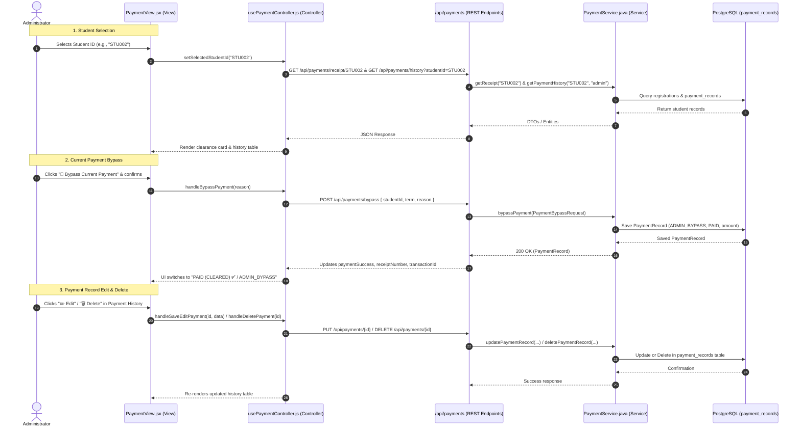

# Admin Payments & Role-Based Access Control Workflow

This workflow documents the architectural design, sequential communication paths, and security boundaries implemented for:
1. **Access Control**: Restricting **Create Routine** to students only (hidden from Admin & Faculty) and restricting **Payments** to Students and Admins (hidden from Faculty).
2. **Admin Payment Management**: Student ID selector inside payments tab, empty state when no student is selected, current payment bypass, and database payment record edit/delete capabilities.

---

## 1. Architectural Overview (MVC Pattern)

---

## 2. Sequential Communication Paths

### Path A: Role-Based Navigation & Route Access Control
- **Sidebar (`Sidebar.jsx`)**:
  - `routine` (`Create Routine`): Filtered with `if (item.id === 'routine' && !isStudent) return;`.
    - Result: Only students see the link. Faculty and Administrators do not see it.
  - `payments` (`Payments`): Filtered with `if (item.id === 'payments' && isFaculty) return;`.
    - Result: Students and Administrators see Payments. Faculty does not.
- **Route Guard (`App.jsx`)**:
  - `<StudentOnlyRoute>` wraps `/routine`: checks `getStoredUser()?.role`; redirects non-students to `/dashboard`.
  - `<NonFacultyRoute>` wraps `/payments`: checks `getStoredUser()?.role === 'FACULTY'`; redirects faculty to `/dashboard`.

---

### Path B: Admin Student Selection Inside Payment Page
1. **View Layer (`PaymentView.jsx`)**:
   - For `isAdmin`, displays the `admin-student-selector-card` inside the payment main content.
   - Contains a clean `<select>` displaying strictly Student IDs (`STU001`, `STU002`, `STU004`, etc.).
   - **Crucial Rule**: When `selectedStudentId === ''`, an empty state (`admin-empty-selection-placeholder`) is displayed with a prompt. No fee receipts, tab bars, or history records are shown until a Student ID is chosen.
2. **Controller Layer (`usePaymentController.js`)**:
   - `useEffect` queries `GET /api/payments/students` when `isAdmin` is true.
   - State `selectedStudentId` starts empty `""`.
   - `effectiveStudentId = isAdmin ? selectedStudentId : (storedUser?.userId || 'STU001')`.
   - When `selectedStudentId` changes to a valid ID, `fetchReceipt()` and `fetchPaymentHistory()` run for that specific student.
3. **Backend Service & Database**:
   - `PaymentController.getStudentIds()` ➔ `PaymentService.getAllStudentIds()` ➔ `StudentProfileRepository.findAll()` ➔ returns sorted, distinct list of student IDs.

---

### Path C: Administrator Payment Bypass
1. **View Layer (`PaymentView.jsx`)**:
   - In Tab 1 (Fee Clearance), if `isAdmin && !paymentSuccess`, displays the `👑 Bypass Current Payment` button.
   - Clicking opens `BypassPaymentModal` displaying the student ID, total amount waived, and a customizable reason input.
2. **Controller Layer (`usePaymentController.js`)**:
   - `handleBypassPayment(reason)` sends `POST /api/payments/bypass` with `{ studentId, term, reason, bypassedBy }`.
3. **Backend Controller (`PaymentController.java`)**:
   - `@PostMapping("/bypass")` delegates to `PaymentService.bypassPayment(PaymentBypassRequest)`.
4. **Backend Service (`PaymentService.java`)**:
   - Calls `PaymentReceiptService.getReceipt(studentId)` to calculate exact course registration fees.
   - Creates a `PaymentRecord` entity with:
     - `paymentMethod = "ADMIN_BYPASS"`
     - `paymentStatus = "PAID"`
     - `bankName = "Administrative Waiver (" + reason + ")"`
     - `netPayable = receipt.getNetPayable()`
   - Saves record into `payment_records` table via `PaymentRecordRepository`.
5. **State Update**:
   - `usePaymentController.js` receives the saved record, updates `receiptNumber`, `transactionId`, sets `paymentSuccess = true`, and re-fetches payment history so the bypass record appears immediately.

---

### Path D: Edit and Delete Previous Payments from Payment History
1. **View Layer (`PaymentView.jsx`)**:
   - When `isAdmin`, the Payment History table renders an **Admin Actions** column with:
     - ✏️ **Edit**: Opens `EditPaymentModal` with inputs for Term, Amount, Status, Method, Bank Name, and Transaction ID.
     - 🗑️ **Delete**: Opens `DeletePaymentModal` confirming permanent database removal.
2. **Controller Layer (`usePaymentController.js`)**:
   - `handleSaveEditPayment(id, updatedFields)`: calls `PUT /api/payments/{id}` and updates local `paymentHistory` state.
   - `handleDeletePayment(id)`: calls `DELETE /api/payments/{id}` and filters out the deleted item from local `paymentHistory` state.
3. **Backend Layer (`PaymentController.java` & `PaymentService.java`)**:
   - `@PutMapping("/{id}")`: `paymentService.updatePaymentRecord(id, request)` updates fields and persists to PostgreSQL.
   - `@DeleteMapping("/{id}")`: `paymentService.deletePaymentRecord(id)` verifies existence and executes `deleteById(id)`.

---

## 3. Files Involved

### Frontend
- [Sidebar.jsx](file:///e:/CS/CampusConnect/frontend/src/views/components/Sidebar.jsx): Access control filtering for `routine` and `payments`.
- [App.jsx](file:///e:/CS/CampusConnect/frontend/src/App.jsx): Role route guards (`StudentOnlyRoute`, `NonFacultyRoute`).
- [usePaymentController.js](file:///e:/CS/CampusConnect/frontend/src/controllers/usePaymentController.js): Student ID loading, bypass, edit, and delete handlers.
- [PaymentView.jsx](file:///e:/CS/CampusConnect/frontend/src/views/pages/PaymentView.jsx): Admin Student Selector, empty prompt state, action toolbar bypass button, history action column, and modals.
- [PaymentView.css](file:///e:/CS/CampusConnect/frontend/src/views/pages/PaymentView.css): Scoped styles for selector card, empty placeholder, bypass button, and edit/delete action pills.

### Backend
- [PaymentController.java](file:///e:/CS/CampusConnect/backend/src/main/java/com/campusconnect/backend/controller/PaymentController.java): Endpoints `GET /students`, `POST /bypass`, `PUT /{id}`, `DELETE /{id}`.
- [PaymentService.java](file:///e:/CS/CampusConnect/backend/src/main/java/com/campusconnect/backend/service/PaymentService.java): Business logic for student ID retrieval, payment bypass record generation, updates, and deletion.
- [PaymentBypassRequest.java](file:///e:/CS/CampusConnect/backend/src/main/java/com/campusconnect/backend/dto/PaymentBypassRequest.java): DTO for payment bypass request.
- [PaymentUpdateRequest.java](file:///e:/CS/CampusConnect/backend/src/main/java/com/campusconnect/backend/dto/PaymentUpdateRequest.java): DTO for updating payment records.
- [PaymentRecord.java](file:///e:/CS/CampusConnect/backend/src/main/java/com/campusconnect/backend/model/PaymentRecord.java): JPA Entity.

### Tests
- [test_admin_payments.ps1](file:///e:/CS/CampusConnect/test_admin_payments.ps1): Automated end-to-end verification test script.

---

## 4. Automated Verification Results

The automated test script (`test_admin_payments.ps1`) was executed against the live backend:
1. **Admin Login (`ADM001`)**: Passed (`role: ADMIN`).
2. **Student Login (`STU001`)**: Passed (`role: STUDENT`).
3. **GET `/api/payments/students`**: Passed (Retrieved distinct student IDs: `STU001, STU002, STU003, STU004, STU0067, STU007`).
4. **POST `/api/payments/bypass`**: Passed (Created `ADMIN_BYPASS` receipt with status `PAID`).
5. **PUT `/api/payments/{id}`**: Passed (Updated record with new amount, bank name, and status).
6. **DELETE `/api/payments/{id}`**: Passed (Permanently removed record from PostgreSQL).
7. **Verification of Deletion (404)**: Passed (Confirmed record no longer accessible).
8. **Student History Isolation**: Passed (Strictly private; student only receives their own records).
9. **Frontend Production Build**: Passed (`vite build` succeeded with zero errors).
