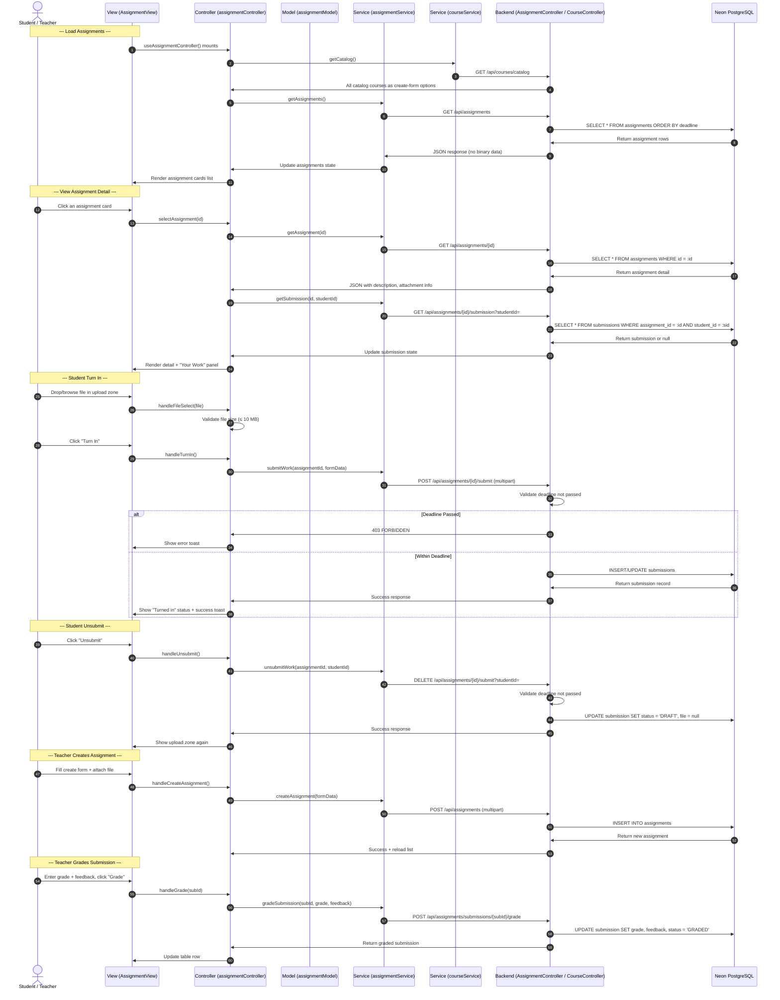

# Assignment Submission Workflow

This document describes the workflow for the Assignment Submission feature in CampusConnect.

## 1. User Story / Requirement
- **Teachers:** Can create assignments with title, description, points, deadline, and an optional question file attachment. Can view all student submissions and grade them with scores and feedback.
- **Students:** Can view assignment details, upload a file, and "Turn In" their work before the deadline. Can "Unsubmit" and re-upload while the deadline is still open. Submissions are blocked after the deadline passes.
- **Deadline Enforcement:** The system enforces deadlines server-side — the backend rejects submissions after the deadline. The frontend also disables upload controls when overdue.

---

## 2. Sequential Data & Logic Flow

---

## 3. Role-Based Access Control

| Role | Assignment permissions |
| --- | --- |
| Student | View questions and attachments; upload, replace, or unsubmit only their own file before the deadline. |
| Faculty | Create and edit assignment questions and deadlines; view every submission and its protected file; cannot submit work. |
| Admin | Create and edit assignments/deadlines, view submissions, and submit their own work before the deadline. |

The frontend uses these three explicit capabilities: `canManageAssignments`, `canViewSubmissions`, and `canSubmit`. The API checks the authenticated JWT role again for every protected action; it derives a submitter's user ID from the JWT rather than trusting a request-supplied ID. The service remains the final authority for deadline enforcement on both submit and unsubmit actions.

### Listing visibility and due-date ordering

`GET /api/assignments` is sorted by the nearest deadline and scoped by the JWT identity: faculty receive only assignments they created, students receive assignments whose course is in their section registrations, and admins receive every assignment. Overdue assignments are excluded by default. When any exist for the current user, the UI provides a **Show past-deadline assignments** button, which calls the same endpoint with `includeOverdue=true`.

## 4. Files Involved

### Frontend (React MVC)
- **Model:** [assignmentModel.js](file:///e:/CampusConnect/frontend/src/models/assignmentModel.js) — Constants, status configs, deadline helpers, file formatters, course color mappings. Pure JS, no React.
- **Service:** [assignmentService.js](file:///e:/CampusConnect/frontend/src/services/assignmentService.js) — API wrapper for all fetch() calls to the backend. Multipart upload support for file submissions.
- **Controller:** [assignmentController.js](file:///e:/CampusConnect/frontend/src/controllers/assignmentController.js) — Exports `useAssignmentController()` hook. Manages assignment list, detail selection, file upload state, turn-in/unsubmit, teacher create form, and grading. Course dropdown options come from `GET /api/courses/catalog`, not a hardcoded list.
- **Views:**
  - [AssignmentView.jsx](file:///e:/CampusConnect/frontend/src/views/pages/AssignmentView.jsx) — Main page with Google Classroom-style layout: assignment list cards, detail view with description/attachment, student "Your Work" panel with file drop zone + turn-in/unsubmit, teacher create modal, and grading table.
  - [AssignmentPage.css](file:///e:/CampusConnect/frontend/src/views/pages/AssignmentPage.css) — Dedicated styles for assignment cards, detail layout, file drop zone, turn-in buttons, create modal, grading table, and animations.

### Backend (Spring Boot MVC)
- **Model / Entity:**
  - [Assignment.java](file:///e:/CampusConnect/backend/src/main/java/com/campusconnect/backend/model/Assignment.java) — JPA `@Entity` mapped to `assignments` table. Stores assignment metadata, deadline, and optional file attachment as `@Lob`.
  - [Submission.java](file:///e:/CampusConnect/backend/src/main/java/com/campusconnect/backend/model/Submission.java) — JPA `@Entity` mapped to `submissions` table. Stores student file uploads, status, and optional grade/feedback. Unique constraint on (assignment_id, student_id).
- **Repository:**
  - [AssignmentRepository.java](file:///e:/CampusConnect/backend/src/main/java/com/campusconnect/backend/repository/AssignmentRepository.java) — `extends JpaRepository`. Provides `findAllByOrderByDeadlineAsc()`, `findByCourseCode()`.
  - [SubmissionRepository.java](file:///e:/CampusConnect/backend/src/main/java/com/campusconnect/backend/repository/SubmissionRepository.java) — `extends JpaRepository`. Provides `findByAssignmentIdAndStudentId()`, `findByAssignmentId()`, `findByStudentId()`.
- **Service:** [AssignmentService.java](file:///e:/CampusConnect/backend/src/main/java/com/campusconnect/backend/service/AssignmentService.java) — Business logic: CRUD, deadline enforcement, seed data (4 sample BRACU assignments), grading.
- **Controller:** [AssignmentController.java](file:///e:/CampusConnect/backend/src/main/java/com/campusconnect/backend/controller/AssignmentController.java) — REST endpoints with multipart file upload support. Handles assignment CRUD, file downloads, student submissions, and teacher grading.

### Minimal Wiring Changes
- [App.jsx](file:///e:/CampusConnect/frontend/src/App.jsx) — Added `/assignments` route + `AssignmentView` import
- [Sidebar.jsx](file:///e:/CampusConnect/frontend/src/components/Sidebar.jsx) — Replaced Bookmarks nav item with Assignments (icon + route)

### Database (Neon PostgreSQL)
- **Table:** `assignments` — created automatically by `spring.jpa.hibernate.ddl-auto=update`
- **Table:** `submissions` — created automatically with unique constraint `(assignment_id, student_id)`
- **Seed data:** 4 assignments across CSE470, CSE321, CSE220, CSE110 — inserted via `@PostConstruct` on first boot

**No other features changed.** Dashboard, Courses, Routine, Attendance, Club, Advising, Registration, Messaging — all untouched.
