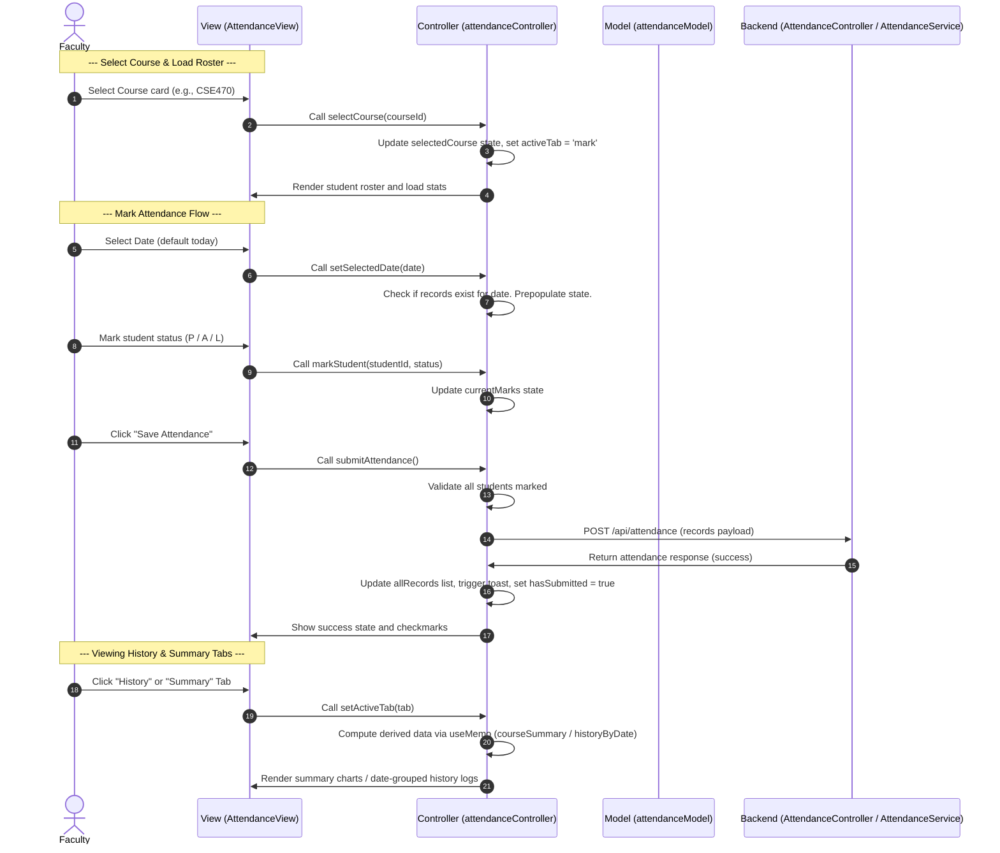

# Faculty Attendance Tracking Workflow

This document describes the workflow for the Faculty Attendance Tracking feature in CampusConnect.

## 1. User Story / Requirement
- **Faculty Users:** Can select from a list of assigned courses, pick a date, load the class student roster, and mark each student as Present, Absent, or Late (or quick-mark all at once).
- **History View:** Faculty can view past attendance sheets, sorted and grouped by date.
- **Summary View:** Faculty can view attendance rates, total counts (Present/Absent/Late), and individual student attendance metrics (e.g. rate, count) represented with progress bars.

---

## 2. Sequential Data & Logic Flow

### Detailed Steps:
1. **Model Initialization:**
   - The list of classes taught by the faculty member is loaded from `FACULTY_COURSES` in `attendanceModel.js`.
   - The student roster mapping is retrieved from `COURSE_STUDENTS` by course ID.
2. **State Management:**
   - The custom hook `useAttendanceController()` initializes the default state (first course selected, date defaults to today via `getToday()`).
   - An effect runs whenever `selectedCourse` or `selectedDate` changes, calling `GET /api/attendance?courseId=X&date=Y` to load existing records from the Neon DB and pre-populate `currentMarks` and setting `hasSubmitted` flag.
3. **Marking Attendance:**
   - The user selects status buttons for each row in the student table, which triggers `markStudent()` in the controller, updating `currentMarks[studentId]`.
   - The user can click "Mark All Present/Absent" which triggers `markAll(status)` in the controller to batch-update the status keys.
4. **Saving:**
   - On click of "Save Attendance", `submitAttendance` runs validation. If all students are marked, it sends one `POST /api/attendance` per student to the real backend.
   - The backend `AttendanceController.java` receives each payload, hands it to `AttendanceService.java` which calls `AttendanceRecordRepository.save()` (JPA → Neon PostgreSQL).
   - After all POSTs succeed, the frontend refreshes records, history, and summary from the API. Shows a confirmation toast.
5. **History & Summary:**
   - On course change: `GET /api/attendance/history?courseId=X` loads all history from DB; `GET /api/attendance/summary?courseId=X` returns pre-computed stats from the backend.
   - `groupByDate()` and `calculateSummary()` helper functions in `attendanceModel.js` are used for per-student breakdowns in the Summary tab.

---

## 3. Files Involved

### Frontend (React MVC)
- **Model:** [attendanceModel.js](file:///e:/CampusConnect/CampusConnect/frontend/src/models/attendanceModel.js) — Defines course configurations, student lists, and statistical calculators (`calculateSummary`, `groupByDate`). Seed data removed — data now comes from the DB.
- **Controller:** [attendanceController.js](file:///e:/CampusConnect/CampusConnect/frontend/src/controllers/attendanceController.js) — Exports `useAttendanceController()`. Fetches attendance, history, and summary via REST API calls. Submits marks to backend.
- **Views:**
  - [AttendanceView.jsx](file:///e:/CampusConnect/CampusConnect/frontend/src/views/pages/AttendanceView.jsx) — Displays course selection cards, tabs, mark sheets, history list, and summaries.
  - [AttendancePage.css](file:///e:/CampusConnect/CampusConnect/frontend/src/views/pages/AttendancePage.css) — Custom styles for attendance grid, rate bars, calendar inputs, and status states.

### Backend (Spring Boot MVC)
- **Model / Entity:**
  - [AttendanceRecord.java](file:///e:/CampusConnect/CampusConnect/backend/src/main/java/com/campusconnect/backend/model/AttendanceRecord.java) — JPA `@Entity` mapped to `attendance_records` table on Neon PostgreSQL.
- **Repository (NEW):**
  - [AttendanceRecordRepository.java](file:///e:/CampusConnect/CampusConnect/backend/src/main/java/com/campusconnect/backend/repository/AttendanceRecordRepository.java) — `extends JpaRepository`. Provides `findByCourseIdAndDate()`, `findByCourseIdOrderByDateDesc()`, `findByCourseIdAndStudentIdAndDate()`.
- **Service:** [AttendanceService.java](file:///e:/CampusConnect/CampusConnect/backend/src/main/java/com/campusconnect/backend/service/AttendanceService.java) — Injects `AttendanceRecordRepository`. `@PostConstruct seedData()` seeds 3 courses × multiple sessions on first boot.
- **Controller:** [AttendanceController.java](file:///e:/CampusConnect/CampusConnect/backend/src/main/java/com/campusconnect/backend/controller/AttendanceController.java) — Exposes REST endpoints to query and write records.

### Database (Neon PostgreSQL)
- **Table:** `attendance_records` — created automatically by `spring.jpa.hibernate.ddl-auto=update`.
- **Seed data:** 28 records across CSE470 (15), CSE341 (8), CSE221 (6) — inserted via `@PostConstruct` on first boot.
