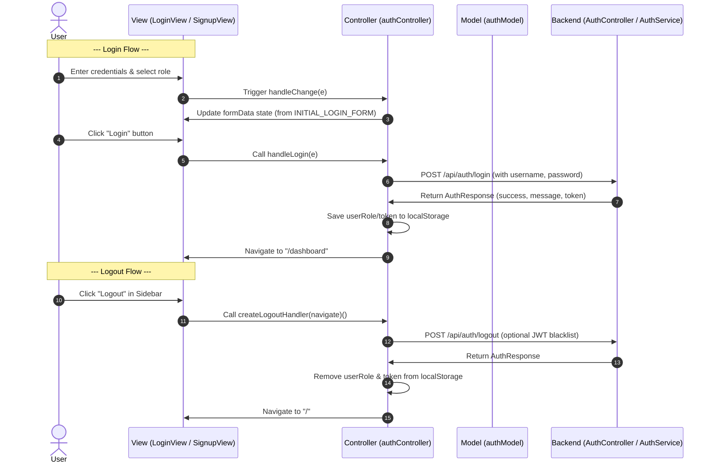

# Authentication Workflow (Login, Signup, Logout)

This document describes the workflow for user authentication (Login, Signup, and Logout) in CampusConnect.

## 1. User Story / Requirement
- **Login:** A user enters their username/email, password, and selects their role (Student, Advisor, Admin). On submit, the app authenticates the user, stores the session role/token, and redirects them to the Dashboard.
- **Signup:** A new user registers by providing their full name, username, email, and password. On submit, an account is created and they are redirected to the Dashboard.
- **Logout:** A logged-in user clicks "Logout" in the sidebar, which clears their session data and redirects them to the Login page.

---

## 2. Sequential Data & Logic Flow

### Detailed Steps:
1. **Model Initialization:** The controller initializes form state using initial structures defined in `authModel.js` (`INITIAL_LOGIN_FORM`, `INITIAL_SIGNUP_FORM`).
2. **Form Interaction:** As the user types in `LoginView` or `SignupView`, inputs trigger the `handleChange` event in the custom hooks `useLoginController` / `useSignupController` inside `authController.js`, updating the state dynamically.
3. **Submission:** Upon clicking Submit:
   - The Controller's `handleLogin` or `handleSignup` method is triggered.
   - (In Phase 2) It sends an HTTP POST request to the backend REST endpoint `/api/auth/login` or `/api/auth/register`.
4. **Backend Processing:**
   - `AuthController.java` parses the HTTP payload into `AuthRequest.java`.
   - It delegates authentication or registration logic to `AuthService.java`.
   - `AuthService.java` returns an `AuthResponse.java` object (containing `success`, `message`, and token details).
   - `AuthController.java` returns this response with an appropriate HTTP status (e.g., `200 OK`).
5. **Session & Navigation:**
   - The controller stores the session role and JWT token (Phase 2) in `localStorage`.
   - The controller triggers `useNavigate` to transition the page view to `/dashboard` (or back to `/` on logout).

---

## 3. Files Involved

### Frontend (React MVC)
- **Model:** [authModel.js](file:///e:/CampusConnect/CampusConnect/frontend/src/models/authModel.js) — Defines `INITIAL_LOGIN_FORM` and `INITIAL_SIGNUP_FORM` schemas.
- **Controller:** [authController.js](file:///e:/CampusConnect/CampusConnect/frontend/src/controllers/authController.js) — Exports `useLoginController()`, `useSignupController()`, and `createLogoutHandler()`.
- **Views:**
  - [LoginView.jsx](file:///e:/CampusConnect/CampusConnect/frontend/src/views/pages/LoginView.jsx) — Login page UI, driven by `useLoginController()`.
  - [SignupView.jsx](file:///e:/CampusConnect/CampusConnect/frontend/src/views/pages/SignupView.jsx) — Signup page UI, driven by `useSignupController()`.
  - [App.jsx](file:///e:/CampusConnect/CampusConnect/frontend/src/App.jsx) — Defines routing from `/` and `/signup`.
  - [Sidebar.jsx](file:///e:/CampusConnect/CampusConnect/frontend/src/components/Sidebar.jsx) — Component triggering the logout controller handler.

### Backend (Spring Boot MVC)
- **Model / DTO:**
  - [AuthRequest.java](file:///e:/CampusConnect/CampusConnect/backend/src/main/java/com/campusconnect/backend/dto/AuthRequest.java) — Payload container for incoming credentials.
  - [AuthResponse.java](file:///e:/CampusConnect/CampusConnect/backend/src/main/java/com/campusconnect/backend/dto/AuthResponse.java) — Payload container for outgoing response.
- **Service:** [AuthService.java](file:///e:/CampusConnect/CampusConnect/backend/src/main/java/com/campusconnect/backend/service/AuthService.java) — Performs credential validation and JWT token generation.
- **Controller:** [AuthController.java](file:///e:/CampusConnect/CampusConnect/backend/src/main/java/com/campusconnect/backend/controller/AuthController.java) — Exposes HTTP endpoints mapping requests to the service layer.
