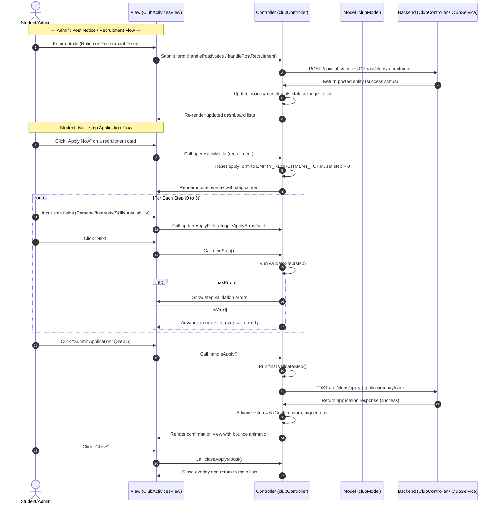

# Club Recruitment Workflow

This document describes the workflow for the Club Activities and Recruitment feature in CampusConnect.

## 1. User Story / Requirement
- **Admin Users:** Can view, post new notices, and post new recruitment listings for clubs.
- **Student Users:** Can view club notices, view active recruitment listings, and apply to recruitment listings through a rich 7-step multi-step form.
- **Form Steps:** Welcome ➔ Personal Info ➔ Interests ➔ Skills ➔ Availability ➔ Final Question ➔ Confirmation.

---

## 2. Sequential Data & Logic Flow

### Detailed Steps:
1. **Model Initialization:**
   - Constants, step mappings, form dropdown selections, and default values are defined in `clubModel.js` (e.g. `RECRUITMENT_FORM_STEPS`, `EMPTY_RECRUITMENT_FORM`, `TEAM_OPTIONS`).
2. **Initial Data Load:**
   - On mount, the controller calls `GET /api/clubs/notices` and `GET /api/clubs/recruitment` in parallel to load real data from the Neon PostgreSQL database.
3. **Tab Navigation:**
   - `ClubActivitiesView.jsx` renders tabs for "Notices" and "Recruitments" based on `activeTab` from `useClubController()`.
4. **Posting notices/recruitments (Admin):**
   - In the admin form panel, input changes update `noticeForm` or `recruitForm` in the controller.
   - On submitting, `handlePostNotice` or `handlePostRecruitment` fires a `POST` to the backend. `ClubController.java` delegates to `ClubService.java` which calls the JPA repository to persist to Neon PostgreSQL. The new object is returned and prepended to the local state list. A toast notification confirms success.
5. **Applying to Recruitment (Student):**
   - Click "Apply Now" launches `openApplyModal(rec)`.
   - The controller sets `applyTarget` and resets step indices and errors.
   - The user proceeds through the overlay. Each page validates inputs via `validateStep()`.
   - On the final step, `handleApply()` sends a `POST /api/clubs/apply` with the form payload.
   - The backend registers the application in the `club_applications` table via `ApplicationRepository.save()` (JPA → Neon PostgreSQL) and returns success.
   - The controller moves to step 6 (Confirmation) showing success details.

---

## 3. Files Involved

### Frontend (React MVC)
- **Model:** [clubModel.js](file:///e:/CampusConnect/CampusConnect/frontend/src/models/clubModel.js) — Defines form step configs and dropdown options. Seed data arrays (`SEED_NOTICES`, `SEED_RECRUITMENTS`) no longer used for initial state — data now comes from the DB.
- **Controller:** [clubController.js](file:///e:/CampusConnect/CampusConnect/frontend/src/controllers/clubController.js) — Exports `useClubController()` hook. Loads notices and recruitments from backend on mount. Submits all mutations (post notice, post recruitment, apply) via REST API calls.
- **Views:**
  - [ClubActivitiesView.jsx](file:///e:/CampusConnect/CampusConnect/frontend/src/views/pages/ClubActivitiesView.jsx) — Displays notices, recruitments, admin panels, and the multi-step application overlay.
  - [ClubActivitiesPage.css](file:///e:/CampusConnect/CampusConnect/frontend/src/views/pages/ClubActivitiesPage.css) — Custom styles for tabs, form controls, progress bars, and animations.

### Backend (Spring Boot MVC)
- **Model / Entities:**
  - [ClubNotice.java](file:///e:/CampusConnect/CampusConnect/backend/src/main/java/com/campusconnect/backend/model/ClubNotice.java) — JPA `@Entity` mapped to `club_notices` table.
  - [Recruitment.java](file:///e:/CampusConnect/CampusConnect/backend/src/main/java/com/campusconnect/backend/model/Recruitment.java) — JPA `@Entity` mapped to `recruitments` table.
  - [Application.java](file:///e:/CampusConnect/CampusConnect/backend/src/main/java/com/campusconnect/backend/model/Application.java) — JPA `@Entity` mapped to `club_applications` table.
- **Repositories (NEW):**
  - [ClubNoticeRepository.java](file:///e:/CampusConnect/CampusConnect/backend/src/main/java/com/campusconnect/backend/repository/ClubNoticeRepository.java) — `extends JpaRepository`. Provides `findAllByOrderByPinnedDescPostedAtDesc()`.
  - [RecruitmentRepository.java](file:///e:/CampusConnect/CampusConnect/backend/src/main/java/com/campusconnect/backend/repository/RecruitmentRepository.java) — `extends JpaRepository`. Provides `findByActiveTrue()`.
  - [ApplicationRepository.java](file:///e:/CampusConnect/CampusConnect/backend/src/main/java/com/campusconnect/backend/repository/ApplicationRepository.java) — `extends JpaRepository`.
- **Service:** [ClubService.java](file:///e:/CampusConnect/CampusConnect/backend/src/main/java/com/campusconnect/backend/service/ClubService.java) — Injects 3 JPA repositories. `@PostConstruct seedData()` seeds 5 notices and 5 active recruitments on first boot.
- **Controller:** [ClubController.java](file:///e:/CampusConnect/CampusConnect/backend/src/main/java/com/campusconnect/backend/controller/ClubController.java) — Exposes API endpoints for retrieving notices/recruitments and posting data.

### Database (Neon PostgreSQL)
- **Tables:** `club_notices`, `recruitments`, `club_applications` — created by `spring.jpa.hibernate.ddl-auto=update`.
- **Seed data:** 5 notices (3 pinned) and 5 active recruitments inserted via `@PostConstruct` on first boot.
