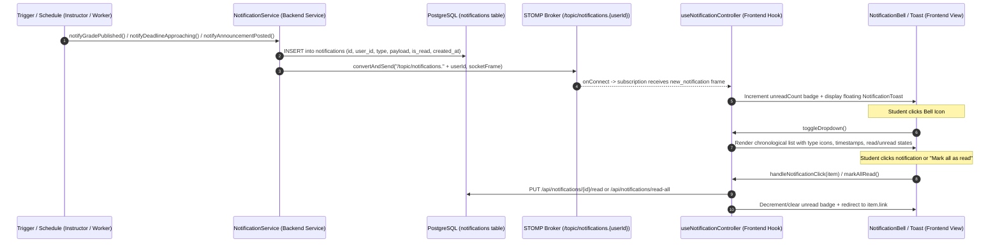

# Real-Time In-App Notification System Workflow

## Overview
An event-driven, real-time in-app notification system strictly for **grades**, **deadlines**, and **announcements** for student users on their dashboard. It provides modular event dispatching, WebSocket delivery over Spring Boot STOMP, and a top-right bell icon with unread badge counter, floating toasts, and a chronological dropdown menu.

---

## Strict Guardrails Followed
- **Trigger Restrictions**: Strictly restricted to `GRADE_PUBLISHED`, `DEADLINE_APPROACHING`, and `ANNOUNCEMENT_POSTED`.
- **Zero External Email Services**: Strictly omitted all external email providers (SendGrid, Resend, SMTP) and background email workers.
- **Zero Seat Monitoring**: Strictly omitted seat/section availability tracking.
- **Target Audience**: Applicable exclusively to student users.
- **WebSocket Reuse**: Reuses the active `/ws` endpoint and `/topic` STOMP broker without duplicate connection handlers.

---

## Sequential Communication Path



---

## Detailed Step-by-Step Flow

### 1. Trigger Engine & Dispatcher
- **`GRADE_PUBLISHED`**:
  - Invoked when an instructor posts/updates a student's grade.
  - Generates payload with assignment title, course code, grade, and optional feedback.
  - Redirect link: `/assignments`.
- **`DEADLINE_APPROACHING`**:
  - Automatically scanned by `DeadlineNotificationWorker` running periodically.
  - Evaluates assignments due in `< 24 hours` where the student has not yet submitted.
  - Deduplicated using in-memory key cache to prevent spam within the 24-hour window.
  - Redirect link: `/assignments`.
- **`ANNOUNCEMENT_POSTED`**:
  - Broadcasts to all enrolled students of a course via section registrations.
  - Redirect link: `/courses`.
- **`ADVISING_CONFIRMED`**:
  - Triggered when an advisor (or student advising process) confirms the advising session for the semester.
  - Informs the student of the approved courses and confirmation by their advisor.
  - Redirect link: `/advising`.

### 2. In-App Real-Time WebSocket Delivery
- For each event, a record is inserted into the `notifications` table (`id`, `user_id`, `type`, `payload`, `is_read`, `created_at`).
- Broadcast is dispatched to `/topic/notifications.{userId}` and `/topic/user-{userId}`.
- Payload structure:
  ```json
  {
    "event": "new_notification",
    "payload": {
      "id": 6,
      "userId": "STU007",
      "type": "GRADE_PUBLISHED",
      "title": "Grade Published: Sprint 2 Architecture Submission",
      "payload": "Your grade for Sprint 2 Architecture Submission (CSE470) is: 98/100 (A)...",
      "link": "/assignments",
      "isRead": false,
      "createdAt": "2026-09-03T20:19:58Z"
    }
  }
  ```

### 3. Frontend MVC Notification UI
- **Model (`notificationModel.js`)**:
  - Type constants (`GRADE_PUBLISHED`, `DEADLINE_APPROACHING`, `ANNOUNCEMENT_POSTED`).
  - Type configurations (icons: 🎓, ⏳, 📢; colors, labels, badge classes).
  - Relative time formatter (`formatRelativeTime`).
- **Controller (`notificationController.js`)**:
  - `useNotificationController(user)` hook managing:
    - Initial REST fetch: `GET /api/notifications?userId={userId}`
    - STOMP WebSocket subscription to `/topic/notifications.{userId}`
    - Handlers: `markAsRead(id)`, `markAllRead()`, `handleNotificationClick(item, navigate)`
    - Auto-dismissing toast alert (5 seconds).
- **View (`NotificationBell.jsx` & `NotificationToast.jsx`)**:
  - Bell button positioned on the top-right corner of the student user dashboard header.
  - Pulsing unread counter badge.
  - Chronological dropdown panel with type-specific icon badges, read/unread states, and "Mark all as read" button.
  - Floating toast alert in the top-right corner upon real-time socket events.

---

## Files Involved

### Backend (Spring Boot)
- **Model**: `backend/src/main/java/com/campusconnect/backend/model/Notification.java`
- **DTO**: `backend/src/main/java/com/campusconnect/backend/dto/NotificationDto.java`
- **Repository**: `backend/src/main/java/com/campusconnect/backend/repository/NotificationRepository.java`
- **Service**:
  - `backend/src/main/java/com/campusconnect/backend/service/NotificationService.java`
  - `backend/src/main/java/com/campusconnect/backend/service/DeadlineNotificationWorker.java`
- **Controller**: `backend/src/main/java/com/campusconnect/backend/controller/NotificationController.java`
- **Configuration**:
  - `backend/src/main/java/com/campusconnect/backend/config/SecurityConfig.java`
  - `backend/run.cmd`

### Frontend (React + Vite)
- **Model**: `frontend/src/models/notificationModel.js`
- **Controller**: `frontend/src/controllers/notificationController.js`
- **View**:
  - `frontend/src/views/components/Notifications/NotificationBell.jsx`
  - `frontend/src/views/components/Notifications/NotificationToast.jsx`
  - `frontend/src/views/components/Notifications/Notifications.css`
  - `frontend/src/views/pages/DashboardView.jsx`
