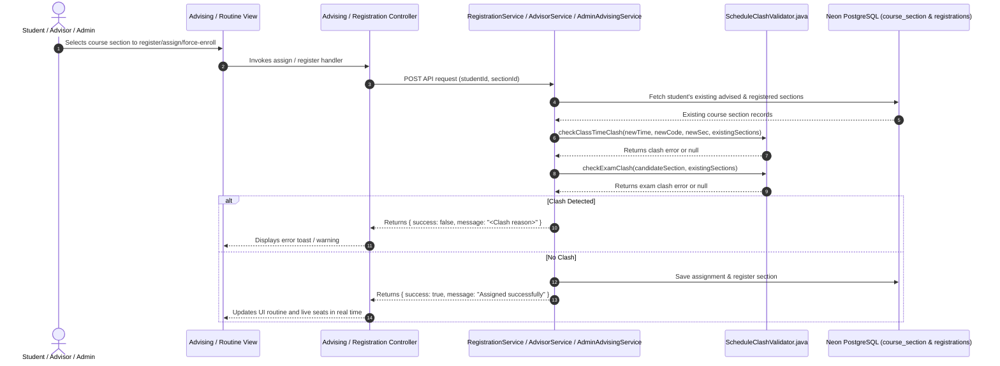

# Schedule & Exam Clash Prevention Workflow

## 1. Feature Overview
This feature enforces strict conflict validation across all 3 enrolment paths (**Student Self-Registration**, **Advisor Course Assignment**, and **Admin Force Registration**):

1. **Class Schedule Clash**:
   - Two courses cannot share the same day and overlapping class times.
   - Example: If a student already has `EEE103-01` on `Sunday (2:00 PM - 3:20 PM)`, attempting to add `CSE101-02` (which also runs on `Sunday (2:00 PM - 3:20 PM)`) is blocked with:
     > `"Class schedule clash: CSE101 clashes with EEE103-01 on Sunday (2:00 PM - 3:20 PM)."`

2. **Exam Schedule Clash**:
   - Two courses cannot have an exam on the **SAME DATE/DAY AND SAME TIME SLOT** (e.g. both Midterm or Final exams scheduled on `Monday, July 27, 2026 at 2:00 PM - 4:00 PM`).
   - If two courses are on the same day but at different times (e.g. 11:00 AM - 1:00 PM vs 2:00 PM - 4:00 PM), it is permitted.
   - If they overlap in day and time, it is blocked with:
     > `"<Midterm/Final> exam clash: <Course A> and <Course B> are both scheduled on <Date> at <Time>."`

---

## 2. Architecture: Strict MVC Sequence

---

## 3. Files Involved

| Layer | File Path | Purpose |
| :--- | :--- | :--- |
| **Component / Validator** | `backend/.../service/ScheduleClashValidator.java` | Centralized interval-based parser for class time slots and exam date/time overlap validation. |
| **Service (Advisor)** | `backend/.../service/AdvisorService.java` | Validates class time & exam clash before assigning courses to students. |
| **Service (Admin)** | `backend/.../service/AdminAdvisingService.java` | Validates class time & exam clash before force-enrolling students. |
| **Service (Student)** | `backend/.../service/RegistrationService.java` | Validates class time & exam clash before self-registering sections. |
