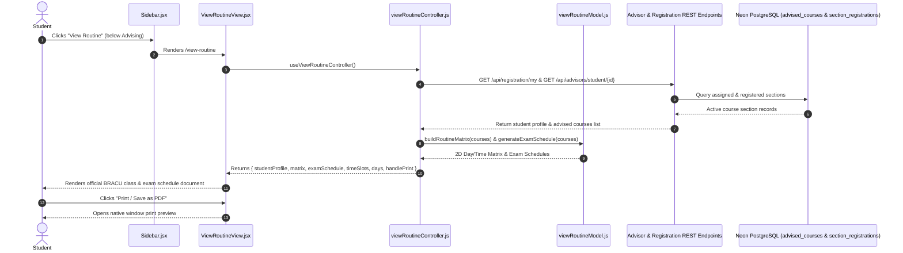

# Student View Routine Feature Workflow

## 1. Feature Overview
The **View Routine** feature provides a dedicated, printable official university schedule document for students. It displays their currently advised and registered courses formatted in the exact tabular structure used by BRAC University:
1. **Class Schedule**: An 8-column matrix (`TIME/DAY`, `SUNDAY`, `MONDAY`, `TUESDAY`, `WEDNESDAY`, `THURSDAY`, `FRIDAY`, `SATURDAY`) where each cell indicates `Course code-Section` and `Faculty-Room`.
2. **Exam Schedule**: A 4-column table detailing Midterm (`MID`) and Final (`FINAL`) exam dates, times, and course codes.
3. **Official Document Styling & PDF Printing**: Features official university header layout with one-click print/save-as-PDF capabilities.
4. **Access Control**: Visible only to the Student profile on the sidebar immediately below the Advising icon.

---

## 2. Architecture: Strict MVC Implementation

---

## 3. Files Involved

| Layer | File Path | Purpose |
| :--- | :--- | :--- |
| **Model** | `frontend/src/models/viewRoutineModel.js` | Pure JS definitions of days, standard time slots, routine matrix builder, schedule normalization, and exam schedule generator. |
| **Controller** | `frontend/src/controllers/viewRoutineController.js` | Custom React hook handling authentication context, REST data loading, matrix computation, and print handlers. |
| **View** | `frontend/src/views/pages/ViewRoutineView.jsx` | Functional React component strictly rendering the official document template and printable tables. |
| **Navigation** | `frontend/src/views/components/Sidebar.jsx` | Dynamically inserts "View Routine" right below "Advising" exclusively for student users. |
| **Router** | `frontend/src/App.jsx` | Registers the `/view-routine` protected route. |

---

## 4. Verification & Testing
- **Frontend Build**: Verified with Vite production build (`npm run build`).
- **Student Profile**: Confirmed `View Routine` icon appears directly below `Advising` for students and is hidden for Admin/Faculty.
- **Data Rendering**: Confirmed live course registrations correctly map to Day/Time cells and display Mid/Final exam schedules.
