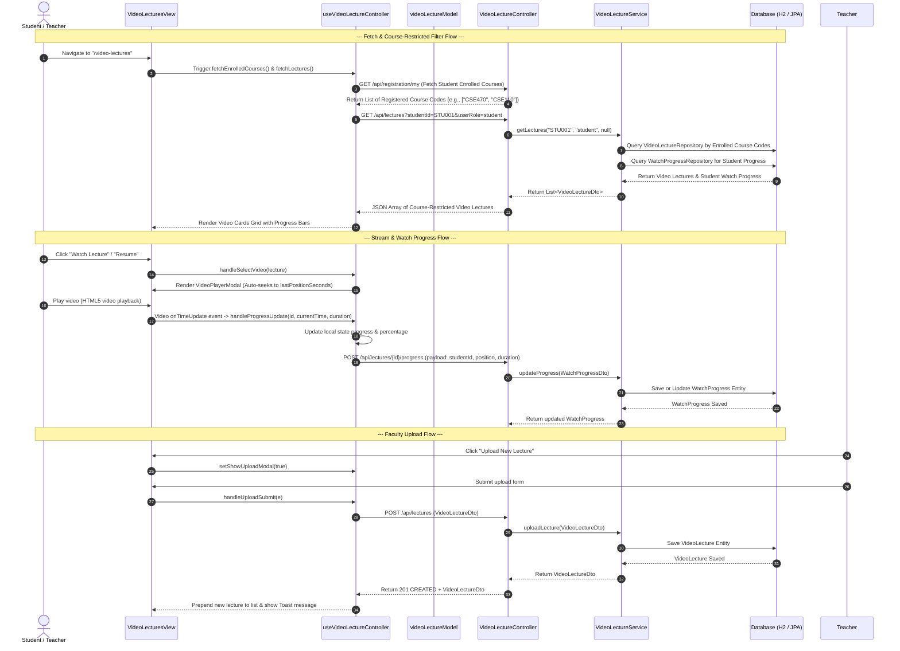

# Video Lecture Streaming & Watch Progress Workflow

This document describes the end-to-end workflow for video lecture streaming, teacher upload, student course-enrollment restriction (advising integration), and real-time watch-progress tracking in CampusConnect.

## 1. User Story & Requirements
- **Teacher / Faculty Access:**
  - Teachers/Admins can upload video lectures (providing Title, Course Code, Description, Video URL, Instructor, and Duration).
  - Teachers can view all video lectures across courses and delete lectures if necessary.
- **Student Access (Advising/Enrollment Restricted):**
  - Students can **only view and stream video lectures for courses they are registered/enrolled in** (e.g. `CSE470`, `CSE110` fetched via Advising/Registration).
- **Watch Progress Tracking:**
  - As students play video lectures, playback position (`currentTime`) and watch percentage are auto-saved.
  - Video cards display status badges (`Not Started`, `In Progress`, `Completed`) and visual progress bars.
  - Reopening a video automatically resumes playback at the last saved timestamp.

---

## 2. Sequential Data & Logic Flow

---

## 3. Files Involved

### Frontend (React MVC)
- **Model:** [videoLectureModel.js](file:///e:/CampusConnect/frontend/src/models/videoLectureModel.js) — Defines initial schemas, fallback data, `formatDuration()`, and `filterLecturesForStudent()`.
- **Controller:** [useVideoLectureController.js](file:///e:/CampusConnect/frontend/src/controllers/useVideoLectureController.js) — Custom hook managing state, course filtering, player selection, progress auto-saving, upload, and deletion.
- **View:** [VideoLecturesView.jsx](file:///e:/CampusConnect/frontend/src/views/pages/VideoLecturesView.jsx) — Page view rendering stats, video grid, embedded player modal, and upload modal.
- **Styling:** [VideoLectures.css](file:///e:/CampusConnect/frontend/src/views/pages/VideoLectures.css) — Custom Vanilla CSS utilizing global tokens in `index.css`.
- **Navigation & Routing Integrations:**
  - [Sidebar.jsx](file:///e:/CampusConnect/frontend/src/views/components/Sidebar.jsx) — Adds `Video Lectures` nav item with SVG icon.
  - [App.jsx](file:///e:/CampusConnect/frontend/src/App.jsx) — Registers `/video-lectures` route.

### Backend (Spring Boot MVC)
- **Model:**
  - [VideoLecture.java](file:///e:/CampusConnect/backend/src/main/java/com/campusconnect/backend/model/VideoLecture.java) — JPA Entity for lectures.
  - [WatchProgress.java](file:///e:/CampusConnect/backend/src/main/java/com/campusconnect/backend/model/WatchProgress.java) — JPA Entity for student watch progress.
- **DTO:**
  - [VideoLectureDto.java](file:///e:/CampusConnect/backend/src/main/java/com/campusconnect/backend/dto/VideoLectureDto.java) — Data transfer object for lecture & progress payloads.
  - [WatchProgressDto.java](file:///e:/CampusConnect/backend/src/main/java/com/campusconnect/backend/dto/WatchProgressDto.java) — Data transfer object for progress updates.
- **Repository:**
  - [VideoLectureRepository.java](file:///e:/CampusConnect/backend/src/main/java/com/campusconnect/backend/repository/VideoLectureRepository.java) — JPA repository for lectures.
  - [WatchProgressRepository.java](file:///e:/CampusConnect/backend/src/main/java/com/campusconnect/backend/repository/WatchProgressRepository.java) — JPA repository for watch progress.
- **Service:** [VideoLectureService.java](file:///e:/CampusConnect/backend/src/main/java/com/campusconnect/backend/service/VideoLectureService.java) — Business logic for lecture filtering, seed data, upload, and watch progress calculations.
- **Controller:** [VideoLectureController.java](file:///e:/CampusConnect/backend/src/main/java/com/campusconnect/backend/controller/VideoLectureController.java) — REST endpoints at `/api/lectures`.
